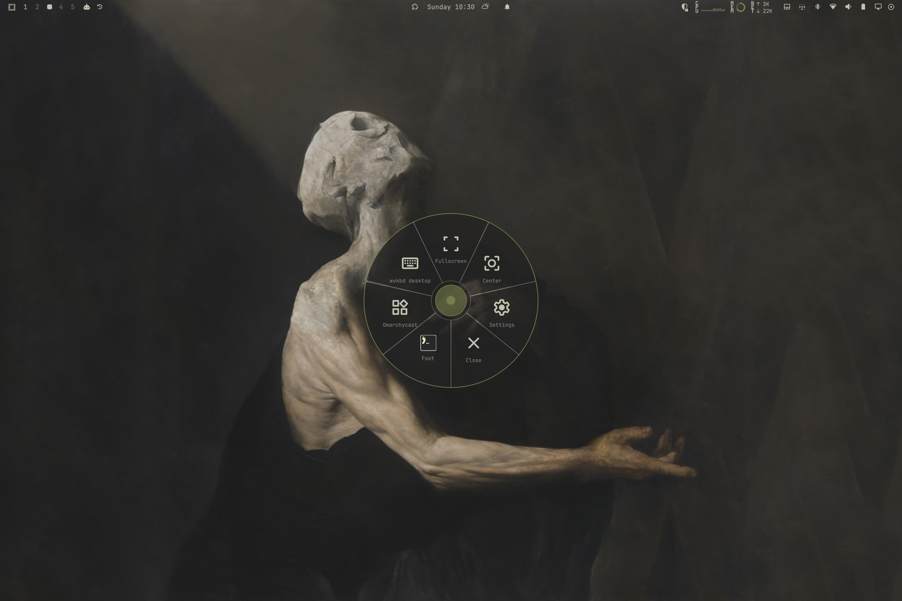
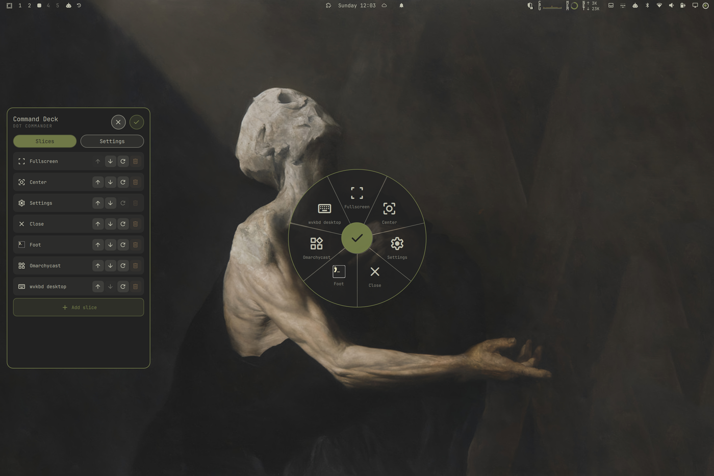
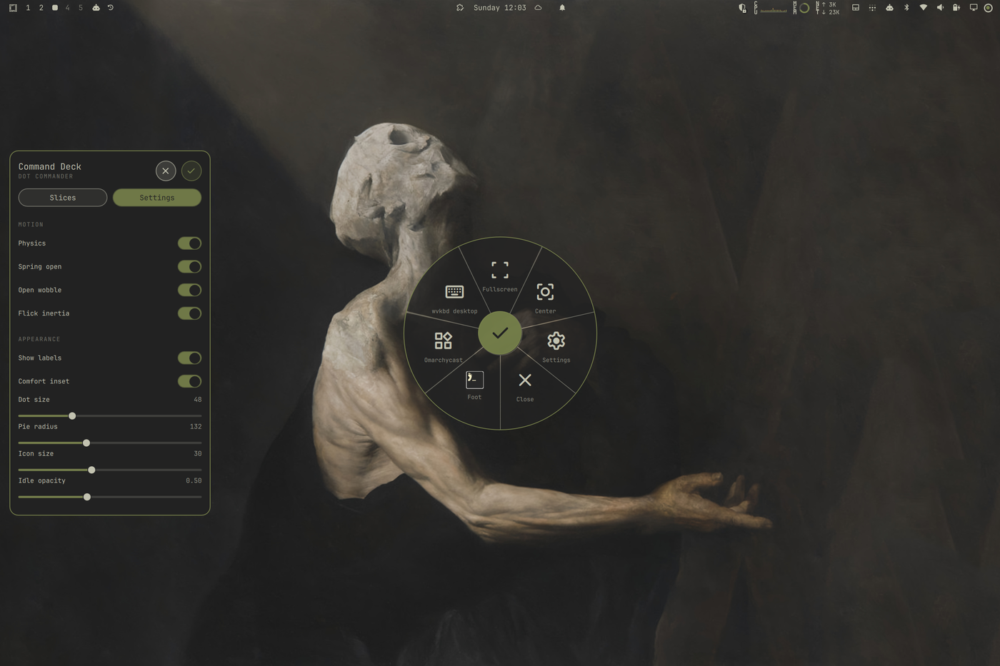
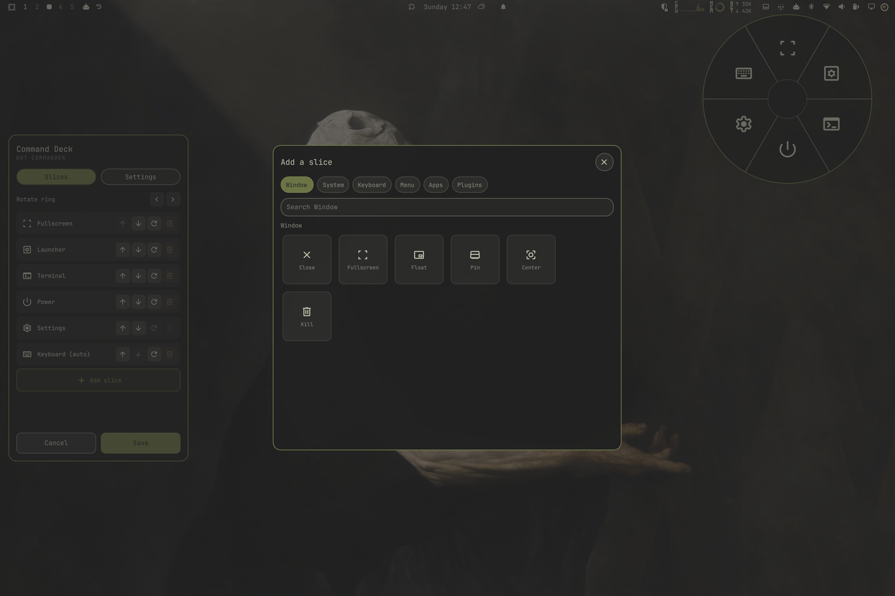

# Dot Com

A draggable on-screen dot that opens a radial menu of window, system, keyboard
and app actions, built for touch-first tablets on [Omarchy](https://omarchy.org).

The stock Omarchy tablet experience buries the handful of actions you actually
reach for behind small bar icons and hotkeys that assume a physical keyboard.
Dot Com puts them under your thumb: one always-available dot you can park
anywhere, and a pie that fans out on tap.

**Dot Com** is short for **Dot Commander** — which is a mouthful, so the dot
answers to Dot Com. The pie is your command wheel; the editor is the Command
Deck.



## What it does

- **Tap the dot** to open the pie; **tap a slice** to run it; **tap away or press
  Esc** to dismiss.
- **Press and hold, then drag** to move the dot anywhere on screen. It stores its
  position as screen fractions, so it lands in the same relative spot on any
  display.
- **Build your own pie** in a WYSIWYG editor: add, remove and drag-reorder slices
  from the Window, System, Keyboard, Menu, Apps and Plugins catalogs.
- **A bar icon** (Touch pie) shows or hides the dot without opening the editor.
- **Theme-aware** — colours and label contrast come from the active Omarchy theme,
  and the dot fades to a configurable idle opacity until you touch it.
- **No dead taps** — a slice whose command or plugin is missing draws dimmed, with
  the reason, instead of failing when you press it.

## Requirements

- Omarchy Quattro (shell plugin support) on Hyprland with the Lua config.
- No root, no network, no background daemon. Everything runs inside the shell
  process you already have.

Individual slices may want extra tools (an on-screen-keyboard backend such as
`wvkbd` or `squeekboard`, or `texp-rotate`). Those slices dim when the tool is
absent, so the plugin works without them.

## Install

```sh
omarchy plugin add https://github.com/ShaggyD/dotcom.git --enable
```

Or by hand: copy this folder to
`~/.config/omarchy/plugins/io.github.shaggyd.dotcom/`, then

```sh
omarchy plugin enable io.github.shaggyd.dotcom
```

The dot appears at 72 % across and down from the top-left. Tap it.

### Bar placement

The bar icon installs in the **right** section by default. Move it anywhere the
shell's bar widgets go:

```sh
omarchy bar move io.github.shaggyd.dotcom --section left    # or center, right
```

### Optional keybinding

A keyboard is not required, but if the dot is ever parked under a fullscreen app,
a key is the way back in. Add to `~/.config/hypr/bindings.lua`:

```lua
o.bind("SUPER + PERIOD",       "Touch pie menu",  "omarchy-shell shell toggle io.github.shaggyd.dotcom '{}'")
o.bind("SUPER + SHIFT + PERIOD", "Edit touch pie", "omarchy-shell shell call io.github.shaggyd.dotcom enterEdit '{}'")
```

## Using it

| Gesture | Action |
|---|---|
| Tap the dot | Open or close the pie |
| Tap a slice | Run it (hold a `+`/`-` slice to ramp: brightness, volume) |
| Press and hold, then drag | Move the dot; a flick glides to a stop and bounces off an edge |
| Tap elsewhere, or `Esc` | Dismiss |
| Right-click the bar icon | Open the Command Deck on Settings |

The default pie has five slices: **Fullscreen**, **Float**, **Keyboard**,
**Apps** and **Settings**. The Settings slice is the only way into the editor
from the pie, so it cannot be removed.

### The Command Deck

Open **Settings** from the pie (`pie.edit`), or **right-click the bar icon**, to
open the Command Deck. While it is up the pie stays beside it as a live,
WYSIWYG preview, and the deck docks on whichever side the dot is not.

**Slices** — build the ring:

- The list shows every slice. **▲ / ▼** reorders it (or drag it around the pie
  itself), **⟳** replaces it from the tile sheet, **🗑** removes it.
- **Add slice** opens the tile sheet. Pick a category (Window, System, Keyboard,
  Menu, Apps, Plugins) and a tile; Menu and Apps come from your live Omarchy
  install, so they stay in sync.
- The Settings slice cannot be replaced or removed — it is the only way into the
  editor from the pie — and the ring keeps at least three slices.
- Tiles that need a binary, backend or plugin you do not have draw dimmed.

**Settings** — the live knobs: Physics, Spring open, Open wobble and Flick
inertia; Show labels and Comfort inset; Dot size, Pie radius, Icon size and Idle
opacity; plus Recenter and Reset all. Settings apply live and autosave.

**Done** (the hub, or ✓) saves the slices; **Cancel** (✕) discards them and
reverts any settings changed since the deck opened.







## Configure

State lives in `~/.local/state/omarchy/dot.json`. The Command Deck writes it —
settings apply live and save automatically, slices save on Done — and the shell
reloads the file on save, so you can also edit it by hand.

| Key | Default | Meaning |
|---|---|---|
| `enabled` | `true` | Show the dot (the bar icon toggles this) |
| `greeted` | `false` | Set after the one-time "reporting for duty" salute |
| `physics` | `true` | Master switch for the motion below |
| `springOpen` | `true` | The pie pops open with a spring overshoot |
| `wobble` | `true` | One-shot damped spin of the ring as it opens |
| `inertia` | `true` | A flicked dot glides to a stop, bouncing off edges |
| `dotSize` | `48` | Dot diameter, px |
| `iconSize` | `30` | Glyph size inside the dot, px |
| `radius` | `132` | Pie radius from the dot centre, px |
| `idleOpacity` | `0.5` | Dot opacity when idle |
| `holdMs` | `600` | Hold time before a press becomes a drag |
| `showLabels` | `true` | Draw slice labels |
| `comfort` | `true` | Keep the whole pie on screen when the dot is near an edge |
| `fx`, `fy` | `0.72` | Position as screen fractions (set by dragging) |
| `slices` | `null` | Your pie; `null` uses the five default slices |

A stored slice references the catalog by `key`, so catalog fixes propagate to it
automatically. A slice can also be a raw entry carrying `label`, `glyph`, and one
of `hypr` (a Hyprland dispatch), `argv` (an argument vector), `app` (launched via
the shell's app library) or `plugin` (handled inside Dot Com), plus `repeat` for
ramping slices.

### Catalog keys

Built-in slices reference these keys (see [`Catalog.js`](Catalog.js)).

| Section | Keys |
|---|---|
| Window | `hypr.window.close`, `hypr.window.fullscreen`, `hypr.window.float`, `hypr.window.pin`, `hypr.window.center`, `hypr.window.kill` |
| System | `sys.apps`, `sys.screenshot`, `sys.record`, `sys.lock`, `sys.rotate`, `sys.nightlight`, `sys.brightup`, `sys.brightdown`, `sys.volup`, `sys.voldown`, `sys.theme`, `sys.setup`, `sys.commander` |
| Keyboard | `sys.keyboard` (auto), `kb.wvkbd_desktop`, `kb.wvkbd_mobile`, `kb.squeekboard`, `sys.keyboard_omarchy` |
| Pie | `pie.recenter`, `pie.edit`, `pie.reset` |
| Menu | every labelled route from Omarchy's menu, as `menu.<route>` |
| Apps | installed desktop applications |

### IPC

```sh
omarchy-shell shell toggle io.github.shaggyd.dotcom '{}'            # open / close the pie
omarchy-shell shell call io.github.shaggyd.dotcom toggleDot '{}'    # show / hide the dot
omarchy-shell shell call io.github.shaggyd.dotcom enterEdit '{}'    # open the Command Deck (Slices)
omarchy-shell shell call io.github.shaggyd.dotcom settings '{}'     # open the Command Deck (Settings)
omarchy-shell shell call io.github.shaggyd.dotcom recenter '{}'     # put the dot back
omarchy-shell shell call io.github.shaggyd.dotcom commander '{}'    # Dot Commander, reporting for duty
omarchy-shell shell call io.github.shaggyd.dotcom debugGeometry     # diagnostics
```

`commander` is the easter egg: it returns the long name with a random salute and
shows it as a notification. There is also a pickable **Commander** tile in the
System catalog, so the bridge can be addressed from the pie itself.

## Remove

```sh
omarchy plugin remove io.github.shaggyd.dotcom
```

That disables the plugin and deletes its folder. Then remove any keybinding you
added, and optionally delete `~/.local/state/omarchy/dot.json`.

## Notes

- Everything runs in the Omarchy shell under your user. Nothing is backgrounded,
  nothing runs as root, and nothing talks to the network.
- Slices execute Omarchy's own CLI (`omarchy ...`), Hyprland dispatchers
  (`hl.dsp.*`), or the on-screen-keyboard wrappers. Commands are argv vectors run
  with `exec "$@"`, so no value is ever re-parsed by a shell.

## Performance

The pie is drawn with one canvas per slice, each sized to the pie rather than to
the screen, and open/close is a scale transform on the whole pie instead of a
repaint of every wedge on every animation frame. A wedge is redrawn only when
its angle, its hover state, or the theme changes — never while the pie is
opening or closing. Measured on a 2× scaled 1368×912 display, an open/close
cycle costs roughly 40 ms of CPU, down from about 430 ms when every canvas was
screen-sized.

## Physics

Motion is on by default and runs on Qt's native spring animations, so it is a
C++-driven transform, not a script loop. Everything is interaction-triggered —
an idle dot does no work at all.

- **Spring open** (`springOpen`) — the pie pops out with a slight overshoot
  instead of easing linearly.
- **Wobble** (`wobble`) — a one-shot damped spin of the ring as it opens.
- **Slice magnet** — the slice under the finger springs outward and grows.
- **Spring reorder** — neighbours spring aside when a slice is dragged.
- **Flick inertia** (`inertia`) — a flicked dot glides to a stop and bounces
  off a screen edge.
- **Squash & stretch** — the dot squashes on press and springs back.
- **Selection ripple** — a ring pulse where a slice was tapped.

`physics` is the master switch; `springOpen`, `wobble` and `inertia` are
independent. Measured as extra CPU on an open/close cycle, the spring pop is
nearly free (~2 ms); the wobble adds ~40 ms because the ring keeps moving for
900 ms, roughly doubling an open/close to ~90 ms. Both still sit about 5× under
the pre-optimisation cost of ~430 ms.

## Development

```sh
omarchy plugin validate .
qmllint -I "$OMARCHY_PATH/shell" Dot.qml BarIcon.qml
omarchy-shell shell rescanPlugins
```

Saving any file under the plugin folder hot-reloads it. If a change to the
overlay does not take effect, `omarchy restart shell` reloads it; the keep-loaded
overlay is not always picked up by `omarchy-shell shell rescanPlugins`.

## License

Apache-2.0.
